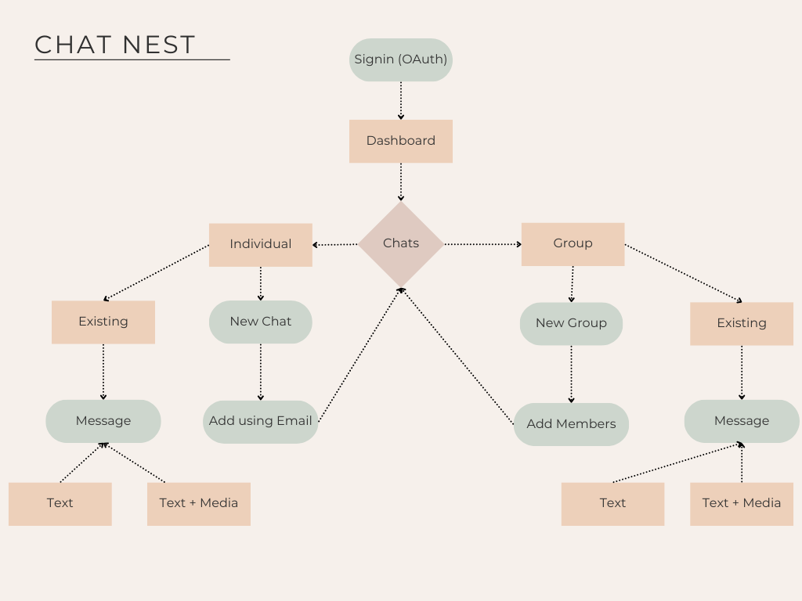

# Chat Nest

**Chat Nest** is a real-time chat app built with **Next.js** and **Supabase**. It supports private and group messaging, real-time updates, and media sharing. The project was created to explore and demonstrate the integration of modern full-stack tools.

## What it does

- Realtime messaging using Supabase's pub-sub
- One-on-one and group chats
- Media/image sharing via Supabase Storage
- Message persistence in PostgreSQL
- Simple and responsive UI

## Flow Overview

## Tech Stack

| Tech          | Usage                                 |
|---------------|----------------------------------------|
| **Next.js**   | Frontend + server routes               |
| **Supabase**  | Realtime, DB, and storage              |
| **Prisma**    | DB schema + migrations                 |
| **shadcn/ui** | UI components                          |
| **NextAuth.js** | OAuth login                          |
| **Tailwind CSS** | Styling                             |